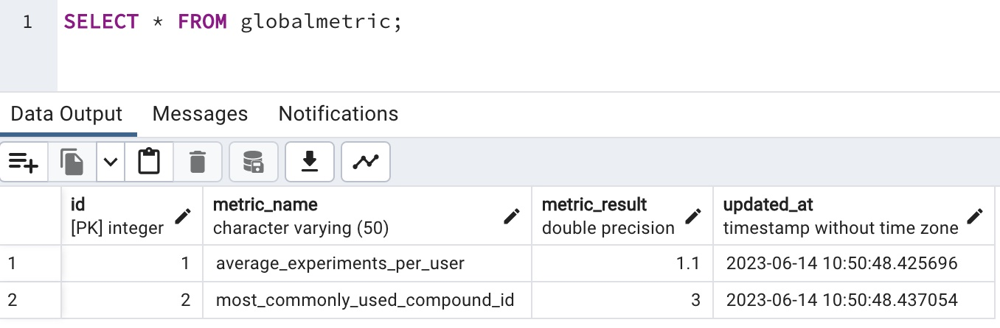

# Backend Engineering Take-Home Challenge

### Introduction
In this challenge, you will be tasked with creating a simple ETL pipeline that can be triggered via an API call. You will be provided with a set of CSV files that you will need to process, derive some features from, and then upload into a database table.

### Challenge Information

  
Click to expand

### Requirements
- Python 3.7+
- Docker
- PostgreSQL

### Challenge
1.  Create a Dockerized application that can be started with a single `docker run` command.

2. The application should expose an API endpoint that triggers an ETL process.

3. The ETL process should:
- Load CSV files from the given data directory.
 - Process these files to derive some simple features.
 - Upload the processed data into a **postgres** table.

4.  The application should be built using Python and any tooling you like for coordinating the workflow and fronting the api server

### Data
You will find three CSV files in the `data`  directory:

- `users.csv`: Contains user data with the following columns: `user_id`, `name`, `email`,`signup_date`.

- `user_experiments.csv`: Contains experiment data with the following columns: `experiment_id`, `user_id`, `experiment_compound_ids`, `experiment_run_time`. The `experiment_compound_ids` column contains a semicolon-separated list of compound IDs.

- `compounds.csv`: Contains compound data with the following columns: `compound_id`, `compound_name`, `compound_structure`.

## Feature Derivation
From the provided CSV files, derive the following features:

1. Total experiments a user ran.
2. Average experiments amount per user.
3. User's most commonly experimented compound.

## Deliverables
Please provide the following in a GITHUB REPOSITORY.

1. A Dockerfile that sets up the environment for your application.
2. A requirements.txt file with all the Python dependencies.
3. A Python script that sets up the API and the ETL process.
4. A brief README explaining how to build and run your application, and how to trigger the ETL process.

Please also provide a script that builds, and runs the docker container. 
You should also provide a script that scaffolds how a user can run the ETL process. This can be `curl` or something else.
Finally, provide a script that queries the database and showcases that it has been populated with the desired features.

## Evaluation
Your solution will be evaluated on the following criteria:

Code quality and organization.
Proper use of Python and Docker.
Successful execution of the ETL process.
Accuracy of the derived features.

### Organization

- `makefile`: Contains all the commands to boot and interact with the containers
- `data/data_loader.py`: Imports the data and preps it for ingestion
- `sql/init.sql`: Used by the postgress container to initializes a db called `science`
- `db/`: Handles writing and reading transactions to the database. I used raw SQL to showcase my skills, but would use an ORM for a real application
- `templates/`: Simple landing page using html

- Quick ERD Mockup

### How to build and run the application

  
Click to expand

  #### Requirements
  - Docker

  #### Running the App
  - run  `make docker-run`

  * This will build and run the application with all the required services

### How to trigger the ETL process

  
Click to expand

- run `make trigger-etl`
* The ETL pipeline uses user_id 1 as an example to calculate metrics

### How to view your database data

  
Click to expand

- run `make view-db-records`
- Alternatively, in a db viewer using port 5433 you can view the following:

